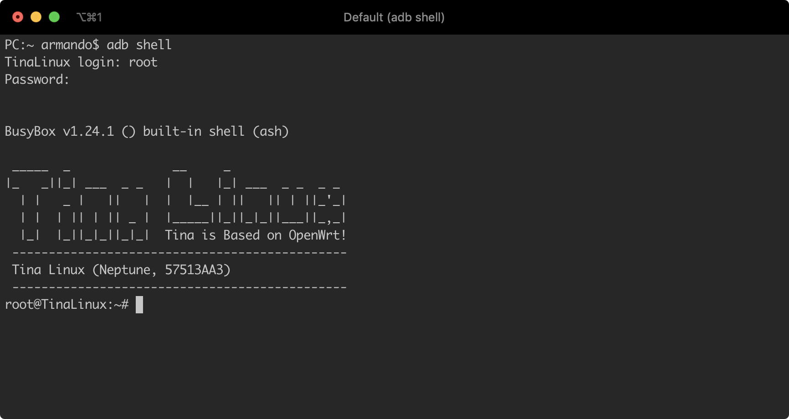

# 

These pages guide you through the installation steps for Cecotec Conga robots.
Support is still somewhat experimental, everything in this guide is under your responsability.

- The default settings here will be for running Valetudo on the robot itself, [standalone installation](#standalane-installation).
- It could run in a server using Docker, [docker installation](#docker-installation).
- If you want to develop as well, check out the [Local Development guide](https://valetudo.cloud/pages/development/building-and-modifying-valetudo.html).

Any of the ways to get Valetudo running for the robot needs root access to your Conga, so here it will be explained too [Robot Setup](#robot-setup).

Please give it a try and [file any issues that you encounter there](https://github.com/Hypfer/Valetudo.git/issues).

- [Summary](#)
  - [Robot setup](#robot-setup)
    - [Connect the robot to your local network](#connect-the-robot-to-your-local-network)
    - [Get root access in your Conga](#get-root-access-in-your-conga)
    - [Point your Conga robot to Valetudo Server](#point-your-conga-robot-to-valetudo-server)
  - [Standalane installation](#standalane-installation)
    - [Build a binary for you standalone installation](#build-a-binary-for-you-standalone-installation)
    - [Prepare a valid configuration file](#prepare-a-valid-configuration-file)
    - [Copy the binary and its configuration to your robot](#copy-the-binary-and-its-configuration-to-your-robot)
    - [Create a script file to export the enviroment variable and run the server at boot in your robot](#create-a-script-file-to-export-the-enviroment-variable-and-run-the-server-at-boot-in-your-robot)
    - [Enable Valetudo server at boot and reboot the robot](#enable-valetudo-server-at-boot-and-reboot-the-robot)
    - [Finally](#finally)
  - [Docker installation](#docker-installation)
    - [Configuration file](#configuration-file)
    - [Use the prepared image](#use-the-prepared-image)
    - [Finally](#finally-1)
  - [Uninstall Valetudo](#uninstall-valetudo)
  - [FAQ](#faq)
  - [Notes:](#notes)

## Robot setup
It is needed for the robot to know wich server it has to attend so then, it should be connected to your local network and point it to the Valetudo server. This is the purpose of the following steps

### Connect the robot to your local network
First, you need to have your robot connected througth your wifi to get shell access. If you already have it, you can jumpthis section, otherwise, you can use the (agnoc tool)[https://github.com/adrigzr/agnoc] form your computer to establish the connection.
```
$ npm install -g @agnoc/cli 
$ agnoc wlan <wifissid> <pass>
```

### Get root access in your Conga
1. Check that you have SSH installed and working in your computer (Linux/MacOS by default, use [Putty](https://www.chiark.greenend.org.uk/~sgtatham/putty/) in Windows)
2. You have to find out the IP address of your Conga (see [this guide](https://techwiser.com/find-ip-address-of-any-device/) on how to)
3. Open an ssh connection to your Conga (change the 192.168.x.x for your Conga's IP address):
	```bash
	PC:~ $ ssh root@192.168.x.x
	```

	and when you get the login prompt, type `root` and then the password depending on your model:

	 - for 3090: `3irobotics`[^1]
	 - for 3x90, 4090 & 5490: `@3I#sc$RD%xm^2S&`[^2]
4. You should see something like this:

1. Now, it would be a good practice to:
   - Change the password (to something non-default and secure 🙏)
   - Add certificates (ssh key-pair) to [access via ssh without passwords](add-ssh-key.md)
  
### Point your Conga robot to Valetudo Server
Open a ssh terminal to your robot and edit the hosts file, your server:
*Server IP for standalone installation: 127.0.0.1*
```
$ ssh root@<conga ip>
$> echo "<your server ip> cecotec.das.3irobotix.net cecotec.download.3irobotix.net cecotec.log.3irobotix.net cecotec.ota.3irobotix.net eu.das.3irobotics.net eu.log.3irobotics.net eu.ota.3irobotics.net cecotec-das.3irobotix.net cecotec-log.3irobotix.net cecotec-upgrade.3irobotix.net cecotec-download.3irobotix.net" >> /etc/hosts
$> /etc/init.d/valetudo enable
$> reboot
```
## Standalane installation
### Build a binary for you standalone installation
Compile Valetudo under the path ./build/armv7/valetudo
```
$ git clone https://github.com/Hypfer/Valetudo.git
$ cd Valetudo
$ npm install
$ npm ci
$ npm run build_openapi_schema # to get access to a swagger api
$ npm run build --workspace=frontend # to get access to the under development new fronted 
$ cd backend
$ npm run build
```
### Prepare a valid configuration file
In your machine, get a valid valetudo config file in from: <https://github.com/Hypfer/Valetudo/blob/release/backend/lib/res/default_config.json?raw=true>

*At editing time, the newest release is (2021.08.1)[https://github.com/Hypfer/Valetudo/blob/2021.08.1/backend/lib/res/default_config.json?raw=true]*

Once you have already downloaded IT, edit the implementation of the valetudo robot to CecotecCongaRobot:
```
{
  ...
  "robot": {
    "implementation": "CecotecCongaRobot",
    "implementationSpecificConfig": {
      "ip": "127.0.0.1"
    }
    ...
}
```

### Copy the binary and its configuration to your robot
After that, you are able to copy the binary to your conga
```
$ ssh root@<robot-ip>
$> mkdir /mnt/UDISK/valetudo
$> exit
$ scp ./build/armv7/valetudo root@<your robot ip>:</mnt/UDISK/valetudo>
$ scp ./build/armv7/valetudo root@<your robot ip>:</mnt/UDISK/valetudo_config.json>
```
### Create a script file to export the enviroment variable and run the server at boot in your robot
```
ssh root@<your conga ip>
$> vi /etc/init.d/valetudo
```

add this script:
```
#!/bin/sh /etc/rc.common                                                                                                    
# File: /etc/init.d/valetudo
# Usage help: /etc/init.d/valetudo
# Example: /etc/init.d/valetudo start
START=85
STOP=99                                     
USE_PROCD=1                                                                                                                
PROG=/mnt/UDISK/valetudo/valetudo
CONFIG=/mnt/UDISK/valetudo/valetudo_config.json                                     
start_service() {                     
  procd_open_instance                 
  procd_set_param env VALETUDO_CONFIG_PATH=$CONFIG
  procd_set_param command $PROG    

  procd_set_param respawn ${respawn_threshold:-3600} ${respawn_timeout:-10} ${respawn_retry:-5}
  procd_close_instance                
}                                                                                                                          
shutdown() {                                                                                                            
  echo shutdown                                                                                                   
}
```

### Enable Valetudo server at boot and reboot the robot
```
$ ssh root@<conga ip>
$> /etc/init.d/valetudo enable
$> reboot
```
### Finally
:tada: With theses steps, you may see your Valetudo server running under <http://ip-robot>

## Docker installation
### Configuration file
Firstly, get a valid valetudo config file in <https://github.com/Hypfer/Valetudo/blob/release/backend/lib/res/default_config.json?raw=true>

*At editing time, the newest release is (2021.08.1)[https://github.com/Hypfer/Valetudo/blob/2021.08.1/backend/lib/res/default_config.json?raw=true]*
### Use the prepared image
Then, you are able to just run the dockerhub image
```
sudo docker run --name valetudo -p 8081:8081 -p 4010:4010 -p 4030:4030 -p 4050:4050 -v $(pwd)/valetudo.json:/etc/valetudo/config.json -v valetudo_data:/data --name valetudo adrigzr/valetudo-conga:alpine-latest
```
### Finally
:tada: With theses steps, you may see your Valetudo server running under <http://ip-server:8081>

## Uninstall Valetudo

This will remove Valetudo, free the diskspace and re-enable the cloud interface.

```shell
ssh root@<robot ip>
$> /etc/init.d/valetudo stop
$> rm /etc/init.d/valetudo /mnt/UDISK/valetudo
$> sed '/cecotec.das.3irobotix.net/d' /etc/hosts
```

## FAQ
1. I have Valetudo up and running but any robot is found
```
Check if hosts file in the robot is already edited.
Ping to a one of the cecotec cloud server instances to check if it reaches the conga ip, i.e.:
ping cecotec.das.3irobotix.net
```
2. I try to run a dockerize Valetudo server in my Raspberry server with Raspbian, but I got an error
```
Check (this link)[https://www.gitmemory.com/issue/Koenkk/zigbee2mqtt/7662/852985841]
```
3. Integrate it in Home Assistant
- If you have a Home Assistant instance, you may try the [valetudo addon](https://github.com/txitxo0/valetudo-addon)

## Notes
[^1]: Model 3090 original password hash `$1$ZnE1NgOT$oWafIj8xgsknzdJmRZM9N/` == `3irobotics`
[^2]: Model 3x90 original password hash `$1$trVg0hig$L.xDOM91z4d/.8FZRnr.h1` == `@3I#sc$RD%xm^2S&`