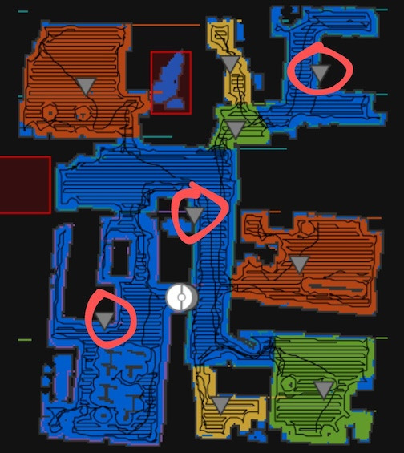

# Map Zones Unclickable Issue

Sometimes, the map creates zones that appear unclickable. This usually happens when zones have been merged or split. It is related to the map painting algorithm.

**Don't worry!** These zones can still be selected.

## How to Select an Unclickable Zone

When you encounter an unclickable zone:

- Look for the zone triangle (grey triangle icon).
- Instead of clicking directly on the triangle, click carefully on the border or edge of the triangle.

### Example

In the following image, the highlighted triangles indicate typical unclickable zones:

Click on the **border or edge** of these triangles instead of the center to successfully select the zone.

This workaround resolves the clicking issue without any further problems.
